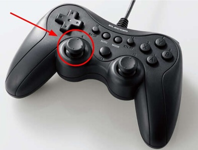
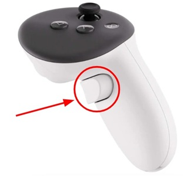

Realtime control
================
There are use cases where you may want to control the gripper in realtime,
like doing remote control of a robotic system (teleoperation, teaching
Physical AI, ...)

With its default baudrate of 115200 bps the gripper connected to a PC via USB
can receive control commands at a frequency close to 100Hz. Considering that
human vision is between 30 and 60 hz and that we are actually using our
vision to do remote control operation, the default control frequency is
sufficient.

.. note::

    Using robotiq user interface (RUI), it is possible to increase the gripper
    baudrate.

The gripper is typically controlled with a joystick.

The analog signal of such a joystick may be [-1,1] in the case of a game
console controller:

Or in the range [0,1] in the case of a VR controller trigger:

.. note::

    The quality of joystick is important to take into account. You will not be
    able to control the gripper with precision if you don't have a good control
    signal.

    You have to also consider your ability to operate the joystick. Like for
    computer games, an experienced gamer will navigate with greater precision
    in the game than a beginner player.

2 functions designed to be called at high frequency for realtime control are
available in the pyrobotiqgripper package.

1) realTimePositionMove function

2) realTimeSpeedMove function

.. note::

    In case of a trigger joystick of a VR controller, a button could be used
    to reverse the signal so that the signal range goes from [0,1] to [-1,1]

1- Realtime control with position signal
----------------------------------------

.. youtube:: 55NyOWzFGxA

.. note::
    The above video is about the first prototype of the realTimePositionMove
    function. Function name changed to realTimePositionMove and the input is a
    [0,1] analog signal instead of a 0-255 position value.

Example of realtime control loop with realTimePositionMove function.

.. code-block:: python

    ################
    # Initialisation
    ################

    # 1- Connect a Joystick with pygame for example

    import pygame
    pygame.joystick.init()
    js = pygame.joystick.Joystick(0) #Select joystick with ID 0
    js.init()

    # 2- Connect the gripper

    gripper = RobotiqGripper() #Default parameters in this case

    # 3- Gripper initialisation

    gripper.connect()
    gripper.activate()
    gripper.start()
    gripper.calibrate_speed()
    gripper.open()

    ###############################
    # Gripper realtime control loop
    ###############################

    while true:
        # Get joystick axis position
        pygame.event.pump()
        positionSignal = js.get_axis(0)

        # Feed the realTimePositionMove function with joystick signal
        gripper.realTimePositionMove(positionSignal)

The realTimePositionMove method is designed to be called in a loop with a high frequency.
It will move the gripper to the requested position with a speed that depends on
the distance to the target position. This allows for a smooth and responsive
control of the gripper.

This function takes a position signal [0,1] as input
and sends a position, speed and force command to the gripper.
As it is difficult to manually maintain a fixed position of the gripper it may
be difficult to control the gripper with precision with this method. It is easy
to face a situation where the joystick oscillates around a position and
generates gripper jerky motion.

2- Realtime control with speed and force signals
------------------------------------------------

Example of realtime control loop with realTimeSpeedMove function.

.. code-block:: python

    ################
    # Initialisation
    ################

    # 1- Connect a Joystick with pygame for example

    import pygame
    pygame.joystick.init()
    js = pygame.joystick.Joystick(0) #Select joystick with ID 0
    js.init()

    # 2- Connect the gripper

    gripper = RobotiqGripper() #Default parameters in this case

    # 3- Gripper initialisation

    gripper.connect()
    gripper.activate()
    gripper.start()
    gripper.calibrate_speed()
    gripper.open()

    ###############################
    # Gripper realtime control loop
    ###############################

    while true:
        # Get joystick axis position
        pygame.event.pump()
        speedSignal = js.get_axis(0)
        forceSignal = js.get_axis(1)

        # Feed the realTimeSpeedMove function with joystick signal
        gripper.realTimeSpeedMove(speedSignal,forceSignal)

This function takes a speed signal [-1,1] and a force
signal [-1,1] as input and sends a position, speed and force command to the
gripper.

This method allows greater control precision. The operator pushes the speed
joystick out of the neutral position one way or another to move the gripper,
and when the joystick is released the gripper stays in its current position.
The force joystick gives the possibility to adjust the force applied by the
gripper.

Joystick CLI Feature
--------------------

The pyrobotiqgripper package includes a command-line interface CLI to
experiment with the realtime functions.

A joystick or a mouse can be used to control the gripper.

This CLI requires the `all` dependencies to be installed.

.. code-block:: bash

    uv add "pyrobotiqgripper[all]"

To use the Joystick CLI, run the following command:

.. code-block:: bash

    pyrobotiqgripper-joystick

.. note::

    By default the application will automatically detect the port on which
    the gripper is connected. It expects that the gripper is connected to
    the PC via USB and that a joystick is also connected to the PC.

You can check the help for details about available options:

.. code-block:: bash

    pyrobotiqgripper-joystick --help

Here below is an example where the application is launched with mouse control.
The gripper communication is done via Modbus RTU over TCP.
The communication control loop uses speed control (i.e. implements realTimeSpeedMove)

.. code-block:: bash

    pyrobotiqgripper-joystick --connection-type "RTU_VIA_TCP" --tcp-host 10.0.0.153 --tcp-port 2000 --joystick-id -1 --verbose 1 --control-method speed